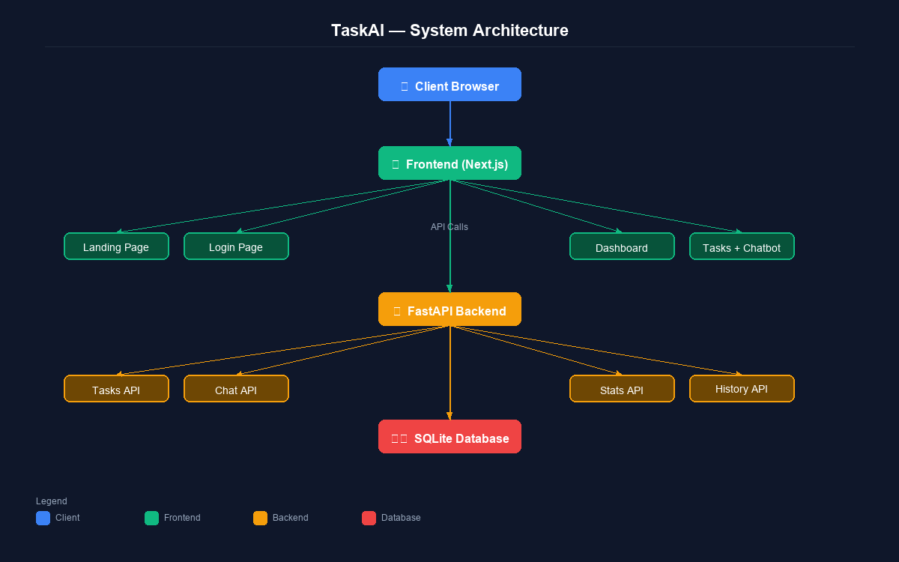

# 🚀 TaskAI – AI-Powered Task Manager

> A professional full-stack task management application with an AI chatbot, smart suggestions, and a beautiful dark dashboard. Built by **Zohair Azmat**.

✅ **Live Full-Stack AI Task Manager deployed on Vercel + Hugging Face Spaces**

[](https://taskai-zohair.vercel.app/) [](https://zohairazmat-ai-task-manager-backend.hf.space) [](https://zohairazmat-ai-task-manager-backend.hf.space/docs)

     

---

## 🌐 Live Links

| | Link |
|--|------|
| 🌐 **Frontend** | [taskai-zohair.vercel.app](https://taskai-zohair.vercel.app/) |
| 🤗 **Backend API** | [zohairazmat-ai-task-manager-backend.hf.space](https://zohairazmat-ai-task-manager-backend.hf.space) |
| 📚 **API Docs** | [zohairazmat-ai-task-manager-backend.hf.space/docs](https://zohairazmat-ai-task-manager-backend.hf.space/docs) |
| 🐙 **GitHub** | [Ai-Task-Manager-Zohair](https://github.com/zohair-azmat-ai/Ai-Task-Manager-Zohair) |

---

## 🎬 Demo Video

> 🎥 Demo video will be added soon.

---

## 📖 Overview

TaskAI is a modern, production-quality task manager that lets you manage your work through both a clean UI and natural language commands. The AI assistant understands commands like *"add finish report by friday"* or *"what should I do today?"* — and if no OpenAI key is configured, a smart rule-based engine handles everything seamlessly.

Built as a portfolio project demonstrating:
- 🏗️ Full-stack architecture (Next.js 14 + FastAPI)
- 🤖 AI/LLM integration with graceful fallback
- 🎨 Professional dark UI with responsive design
- 🧹 Clean code organization and best practices

**Demo credentials:** `demo@taskai.com` / `demo123`

---

## ✨ Features

| Feature | Details |
|---------|---------|
| 🤖 **AI Chatbot** | Natural language task management. OpenAI GPT or smart rule-based fallback |
| ✅ **Task CRUD** | Create, edit, delete, complete with priority, due dates, tags, categories |
| 💡 **Smart Suggestions** | Overdue warnings, today's priorities, productivity recommendations |
| 📊 **Dashboard Analytics** | Completion rate, stats cards, weekly progress |
| 📜 **Activity History** | Full timeline of every create/update/delete/complete event |
| 🔍 **Search & Filters** | Filter by status, priority, category — search across title/description/tags |
| 🔐 **Demo Auth** | Protected routes with localStorage session |
| 📚 **API Docs** | Auto-generated Swagger UI at `/docs` |

---

## 🏗️ Architecture



---

## 🖼️ Screenshots

### 🏠 Landing Page
The dark hero page with gradient accents and animated feature highlights.

### 🔑 Login Page
Clean auth form with demo credentials — no registration required.

### 📊 Dashboard
Full-featured overview with stats cards, AI chatbot panel, smart suggestions, and activity feed — all in a collapsible sidebar layout.

---

## 🛠️ Tech Stack

### Frontend
- **Next.js 14** — App Router, TypeScript
- **Tailwind CSS** — Custom dark theme design system
- **Axios** — API client
- **Lucide React** — Icons
- **date-fns** — Date formatting

### Backend
- **FastAPI** — High-performance Python API
- **SQLAlchemy 2.0** — ORM with async-ready structure
- **SQLite** — Zero-config database (swappable to PostgreSQL via env var)
- **Pydantic v2** — Request/response validation
- **OpenAI SDK** — GPT integration with fallback
- **Uvicorn** — ASGI server

---

## 🤖 AI Chatbot Commands

The chatbot works with or without an OpenAI API key.

| Command | Example | Action |
|---------|---------|--------|
| ➕ Add task | `add buy milk tomorrow` | Creates a task with due date |
| 📝 Create task | `create finish report by friday` | Creates a task |
| 📋 Show pending | `show pending tasks` | Lists pending tasks |
| 📂 Show all | `show all tasks` | Lists all tasks |
| ✅ Complete task | `complete gym workout` | Marks matching task done |
| 🗑️ Delete task | `delete old meeting` | Deletes matching task |
| 🗓️ Today's plan | `what should I do today?` | Smart priority suggestions |
| ⚠️ Overdue | `show overdue tasks` | Lists overdue items |
| 📊 Stats | `stats` | Productivity summary |
| ❓ Help | `help` | Lists all commands |

---

## 🔌 API Routes

| Method | Endpoint | Description |
|--------|----------|-------------|
| GET | `/api/tasks/` | List tasks (with filters) |
| POST | `/api/tasks/` | Create task |
| GET | `/api/tasks/{id}` | Get task |
| PUT | `/api/tasks/{id}` | Update task |
| PATCH | `/api/tasks/{id}/complete` | Mark complete |
| DELETE | `/api/tasks/{id}` | Delete task |
| POST | `/api/chat/` | Chatbot message |
| GET | `/api/stats/dashboard` | Dashboard statistics |
| GET | `/api/stats/suggestions` | Smart suggestions |
| GET | `/api/history/` | Activity log |

---

## 📁 Project Structure

```
ai-task-manager-zohair/
│
├── frontend/                       # Next.js 14 app
│   ├── app/
│   │   ├── layout.tsx              # Root layout
│   │   ├── page.tsx                # Landing page
│   │   ├── globals.css             # Global styles
│   │   ├── login/page.tsx          # Login page
│   │   └── dashboard/
│   │       ├── layout.tsx          # Auth guard + sidebar
│   │       ├── page.tsx            # Dashboard overview
│   │       ├── tasks/page.tsx      # Full task manager
│   │       └── history/page.tsx    # Activity timeline
│   │
│   ├── components/
│   │   ├── layout/                 # Sidebar, Header
│   │   ├── dashboard/              # StatsCards, SmartSuggestions, ActivityLog
│   │   ├── tasks/                  # TaskCard, TaskForm, TaskList
│   │   └── chatbot/                # ChatbotPanel
│   │
│   ├── lib/
│   │   ├── api.ts                  # Axios API client
│   │   ├── auth.ts                 # Demo auth helpers
│   │   └── utils.ts                # Formatting, colors, cn()
│   │
│   └── types/index.ts              # TypeScript interfaces
│
├── backend/                        # FastAPI Python app
│   └── app/
│       ├── main.py                 # FastAPI app + CORS
│       ├── database.py             # SQLAlchemy setup
│       ├── models.py               # Task, ActivityLog models
│       ├── schemas.py              # Pydantic schemas
│       ├── routers/                # tasks, chatbot, stats, history
│       └── services/               # task_service, ai_service
│
└── specs/                          # Project documentation
```

---

## 🚀 Deployment

> 🟢 **This project is already live.** The steps below can be used to fork and deploy your own instance.

| Service | Platform | Live URL |
|---------|----------|----------|
| Frontend | Vercel | [taskai-zohair.vercel.app](https://taskai-zohair.vercel.app/) |
| Backend | Hugging Face Spaces | [zohairazmat-ai-task-manager-backend.hf.space](https://zohairazmat-ai-task-manager-backend.hf.space) |
| API Docs | Swagger UI | [.../docs](https://zohairazmat-ai-task-manager-backend.hf.space/docs) |

### Step 1 — Deploy Backend on Hugging Face Spaces

1. Create a new Space at [huggingface.co/spaces](https://huggingface.co/spaces) — SDK: **Docker**
2. Copy the contents of `backend/` into the Space repo root and push
3. Add these **Repository Secrets**:

   | Secret | Value |
   |--------|-------|
   | `FRONTEND_URL` | `https://taskai-zohair.vercel.app/` |
   | `SECRET_KEY` | Any long random string |
   | `OPENAI_API_KEY` | Optional — app works without it |

### Step 2 — Deploy Frontend on Vercel

[](https://vercel.com/new)

1. Import the [GitHub repo](https://github.com/zohair-azmat-ai/Ai-Task-Manager-Zohair) → Root Directory: `frontend`
2. Add this **Environment Variable**:

   | Variable | Value |
   |----------|-------|
   | `NEXT_PUBLIC_API_URL` | `https://zohairazmat-ai-task-manager-backend.hf.space` |

3. Deploy — done.

---

## 💻 Local Development *(optional)*

<details>
<summary>Click to expand local setup instructions</summary>

### Prerequisites
- Node.js 18+, Python 3.10+, npm

### Backend
```bash
cd backend
python -m venv venv
source venv/bin/activate   # Windows: venv\Scripts\activate
pip install -r requirements.txt
cp .env.example .env
uvicorn app.main:app --reload --port 8000
```

### Frontend
```bash
cd frontend
npm install
cp .env.example .env.local
# Set NEXT_PUBLIC_API_URL=http://127.0.0.1:8000 in .env.local
npm run dev
```

Open `http://localhost:3000` and log in with `demo@taskai.com` / `demo123`.

</details>

---

## 🔮 Future Improvements

- 🔐 **Real Auth** — NextAuth.js or Clerk with JWT/sessions
- 🐘 **PostgreSQL** — Production database (just change `DATABASE_URL`)
- 📌 **Kanban Board** — Drag-and-drop task columns
- 📧 **Email Reminders** — Due date notifications via SendGrid
- 💬 **Task Comments** — Per-task discussion thread
- 🔁 **Recurring Tasks** — Daily/weekly repeat
- 📱 **Mobile App** — React Native companion
- ⚡ **Real-time Updates** — WebSocket for live chatbot responses
- 📤 **Export** — Download tasks as CSV or PDF
- 📅 **Calendar View** — Month/week task visualization

---

## 👤 Author

---

**Zohair Azmat**
Full-Stack Developer & AI Enthusiast

🔗 GitHub: [github.com/zohair-azmat-ai](https://github.com/zohair-azmat-ai)

**Stack:** Next.js · TypeScript · FastAPI · Python · SQLAlchemy · OpenAI · Tailwind CSS

---

---

*This project is portfolio-grade software — structured, documented, and built for real-world readability.*
